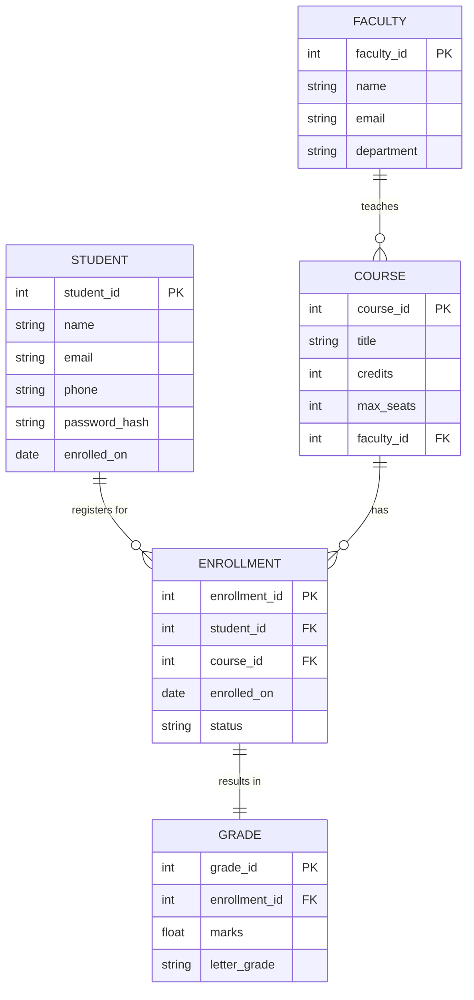
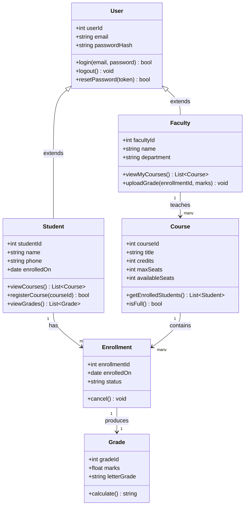
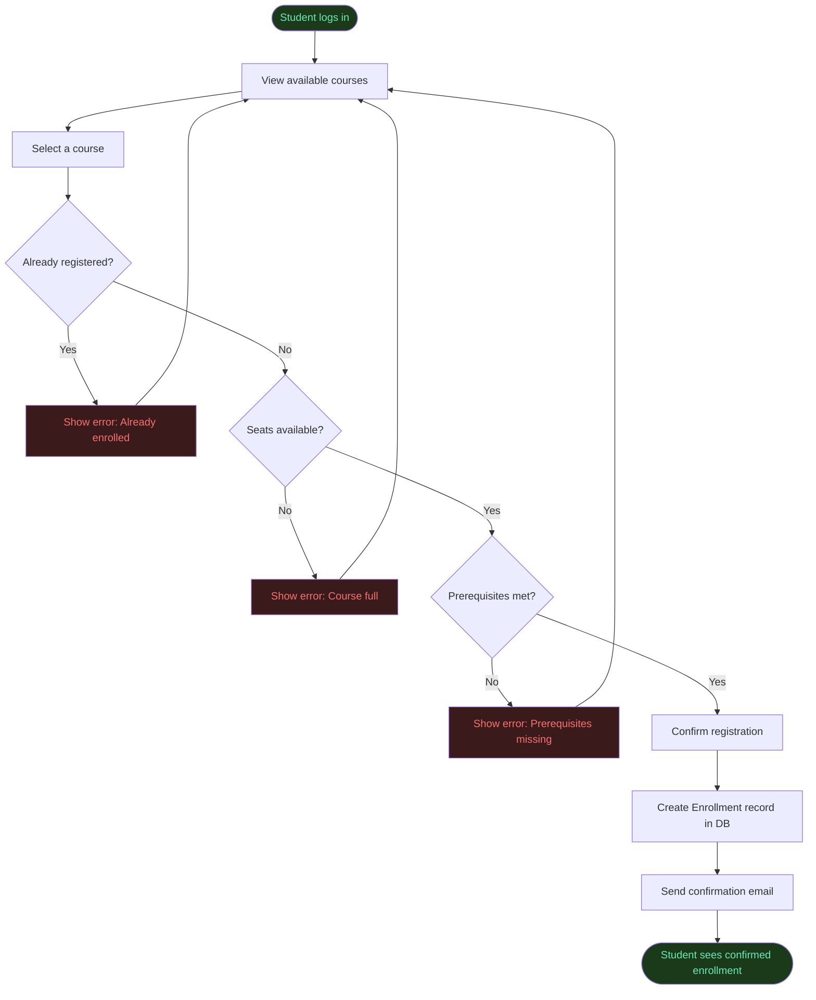
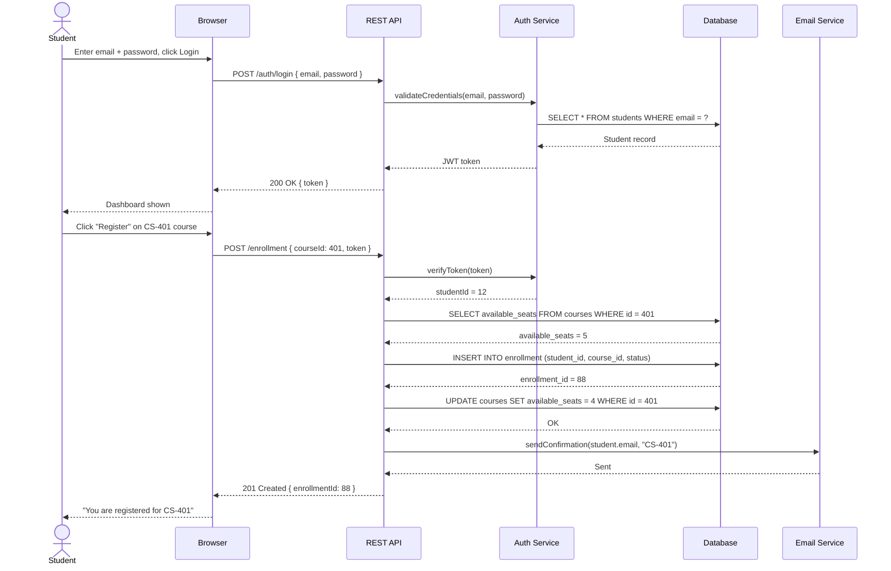

# Sample Diagrams — Student Course Registration System
> This file shows how to write ER, Class, Flow, and Sequence diagrams
> using Mermaid inside a standard Markdown file.
> GitHub renders these automatically. In VS Code, install the "Mermaid Preview" extension.

---

## 1. ER Diagram

Shows all database entities, their fields, and relationships.

---

## 2. Class Diagram

Shows the software classes, their attributes, methods, and relationships.

---

## 3. Flow Diagram — Course Registration Process

Shows the step-by-step process flow with decision points.

---

## 4. Sequence Diagram — Student Registers for a Course

Shows the order of messages between components for one specific user flow.

---

## How to use this file

| Goal | Steps |
|---|---|
| Preview locally | Install "Mermaid Preview" or "Markdown Preview Enhanced" in VS Code |
| Preview on GitHub | Push to repo — GitHub renders Mermaid automatically |
| Export diagram as image | Open [mermaid.live](https://mermaid.live), paste the code block, download PNG/SVG |
| Export full document as PDF | Use "Markdown Preview Enhanced" → right-click → Export → PDF |
| Convert to Word | Run: `pandoc sample_diagrams.md -o sample_diagrams.docx` |

---

*Replace the entities, classes, and steps above with your actual project details.
The structure stays the same — only the names and fields change.*
